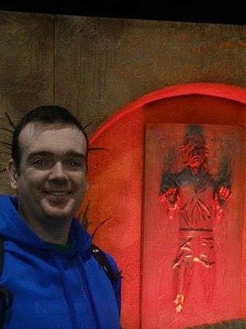

<link rel="apple-touch-icon" sizes="180x180" href="images/favicon/apple-touch-icon.png?v=8j8977eB5g">
<link rel="icon" type="image/png" sizes="32x32" href="images/favicon/favicon-32x32.png?v=8j8977eB5g">
<link rel="icon" type="image/png" sizes="16x16" href="images/favicon/favicon-16x16.png?v=8j8977eB5g">
<link rel="manifest" href="images/favicon/site.webmanifest?v=8j8977eB5g">
<link rel="mask-icon" href="images/favicon/safari-pinned-tab.svg?v=8j8977eB5g" color="#5bbad5">
<link rel="shortcut icon" href="images/favicon/favicon.ico?v=8j8977eB5g">
<meta name="msapplication-TileColor" content="#da532c">
<meta name="msapplication-config" content="images/favicon/browserconfig.xml?v=8j8977eB5g">
<meta name="theme-color" content="#ffffff">

# Welcome to [James Flynn](https://github.com/james-flynn-ie)'s GitHub Pages

Hello and welcome to my GitHub Pages.

Here you will find a bit about me, as well as some links to my current projects.

If you would like to contribute to any of the repositories, then please follow one of the project links and check out the Contributing Guide.

### About Me

I'm a DevOps Engineer living and working in Cork, Ireland. 

By night, I'm an Open Source Contributor.

My hobbies include learning new programming languages and tools through Open Source Software, reading and watching Sci-Fi, Xbox gaming and spending quality time with the dogs.

I'm really interested in learning and contributing to up-and-coming languages and technologies, so please reach out to me if you are involved in an Open Source Software project and think I could be of help to you.

### Project Euler Links

- [projectEulerGo](https://james-flynn-ie.github.io/projectEulerGo)

- [projectEulerJava](https://james-flynn-ie.github.io/projectEulerJava)

Please feel free to check out my [GitHub Profile](https://github.com/james-flynn-ie) to see some of the other Open Source projects I have contributed to.

## Enjoy!
